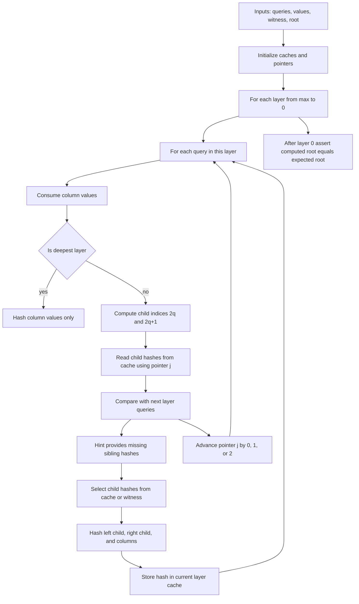

# Merkle Decommitment Verifier (gnark / FRI-style batching)

At a high level, we:

1. start from the **largest (leaf-most) layer** and hash queried column values,
2. move upward layer-by-layer, and for each parent query:
   - rebuild its left/right children hashes from what we already computed (**cache**),
   - pull missing siblings from a **witness decommitment** (via a **hint**),
   - hash `(left || right || columnValues)` to get the parent hash,
3. finally assert the computed root equals the public/root input.

---

## The decommitment protocol

### Inputs

**Queries**

- `queries[l]`: all query indices for layer with log-size `l`.
- Each `queries[l]` is **sorted ascending** and contains a **dummy query at the end**.
- `queriesShape[l] = len(queries[l]) - 1` (ignores dummy).

**Queried values**

- `queriedValues`: flat list of M31 values, consumed in-order.
- For each query at layer `l`, we take `nColumnsPerLogSize[l]` values and treat them as the **column values at that node**.

**Decommitment witness**

- `decommitment.HashWitness`: a sequence of 32-byte hashes that provide the missing siblings needed to recompute parents when only one child was opened.

---

## Layer cache: `layerHashes`

We keep a cache of computed hashes for each layer:

- `layerHashes[layerLog]` is a `logderivlookup.Table`.
- Each computed 32-byte hash is split into `(lo, hi)` using `utils.SplitHash`.
- We insert `lo`, then `hi` into the table.

So entry `k` in “hash units” occupies indices `2k` and `2k+1` in the table:

- `lo = layerHashes[layerLog].Lookup(2k)[0]`
- `hi = layerHashes[layerLog].Lookup(2k+1)[0]`
- `hash = utils.RebuildHash(lo, hi)`

At the end of each layer we append **dummy zeros** (never used for hashing), to keep lookups safe (since we systematically access positions 2k and 2k+1)

---

## How we build a layer from the previous one

We process from `layerLog = maxLogSize` down to `0`.

### Base (deepest) layer: hash only column values

When `layerLog == maxLogSize`, there are no children hashes to combine.
For each query:

- consume `nColumnsInLayer` column values,
- compute:
  - `hash = Blake2sHashNode(nil, nil, columnValues)`
- split and store in `layerHashes[maxLogSize]`.

This creates the “leaf” hashes for the requested openings.

### Inner layers: combine children + (optional) column values

For `layerLog < maxLogSize`, each parent query corresponds to two children indices in the next layer:

- `leftCandidate  = 2*query`
- `rightCandidate = 2*query + 1`

But in a batched opening, the next layer’s query list may contain:

- both children (if both were queried),
- only one child (the other must come from the witness),
- or neither (for FRI, all queries in a layer are paired with their siblings and are not necessarily folded from previous layer)

To efficiently walk the next layer’s sorted query list, we maintain a pointer:

- `j`: index into `queries[layerLog+1]` (the child layer’s queries)

This pointer moves forward as we consume children queries.

---

## Decoding children hashes from the cache (the `twoJ` trick)

For the _child layer_ (`layerLog+1`), we already computed hashes for each child query we processed there.

The `j`-th child query corresponds to the `j`-th computed hash **pair** in `layerHashes[layerLog+1]`.

So we load:

- `h0` = hash for `queries[layerLog+1][j]`
- `h1` = hash for `queries[layerLog+1][j+1]`

Concretely:

- `twoJ         = 2*j`
- `h0Lo = layerHashes[layerLog+1].Lookup(twoJ)[0]`
- `h0Hi = layerHashes[layerLog+1].Lookup(twoJ+1)[0]`
- `h1Lo = layerHashes[layerLog+1].Lookup(twoJ+2)[0]`
- `h1Hi = layerHashes[layerLog+1].Lookup(twoJ+3)[0]`
- `h0 = RebuildHash(h0Lo, h0Hi)`
- `h1 = RebuildHash(h1Lo, h1Hi)`

These are “previous-layer computed hashes”, ready to be used as children.

---

## The key: selecting between cache hashes and witness hashes

For each parent query, we compare candidates against the child query list:

- `isLeftQueried        = (leftCandidate  == queries[layerLog+1][j])`
- `isRightAlsoQueried   = (rightCandidate == queries[layerLog+1][j+1])`
- `isJustRightQueried   = (rightCandidate == queries[layerLog+1][j])`

These three booleans define which children are available from cache.

### Witness hashes are provided via a hint

We request, via a hint, the witness hashes we might need:

- outputs: `w0[32], w1[32], witnessIndex'`
- inputs include:
  - the three booleans,
  - current `witnessIndex` (an external pointer),
  - and _the entire witness list_ `decommitment.HashWitness` flattened into variables.

> Why the hint?
>
> This allows to have a static number of witnesses (always two) that can be picked from and used in `api.Select`.
> We have no guarrantee that the provided witnesses come from the original merkle decommitment witness but forging
> them would mean breaking the hash function which is hard.

### Selection logic

We compute final children hashes as:

- `leftHash = SelectHash(isLeftQueried, h0, w0)`

For the right child, there are two subcases when left is not the first queried entry:

- `intermediate1 = SelectHash(isRightAlsoQueried, h1, w1)`
- `intermediate2 = SelectHash(isJustRightQueried, h0, w1)`
- `rightHash = SelectHash(isLeftQueried, intermediate1, intermediate2)`

Interpretation by case:

| Case                                         | Meaning in child layer                      | leftHash | rightHash | Pointer advance |
| -------------------------------------------- | ------------------------------------------- | -------- | --------- | --------------- |
| `isLeftQueried=1` and `isRightAlsoQueried=1` | both children were queried at `j` and `j+1` | `h0`     | `h1`      | `j += 2`        |
| `isLeftQueried=1` and `isRightAlsoQueried=0` | only left child was queried at `j`          | `h0`     | `w1`      | `j += 1`        |
| `isLeftQueried=0` and `isJustRightQueried=1` | only right child was queried at `j`         | `w0`     | `h0`      | `j += 1`        |
| otherwise                                    | no child was queried (happens for FRI)      | `w0`     | `w1`      | `j` stays       |

So we are **always** choosing each child from:

- a previously computed child hash (`h0` / `h1`) **or**
- a hinted witness hash (`w0` / `w1`)

…and we do it with `api.Select`-style mixing so the circuit remains constraint-friendly.

### Column values are hashed too

Each parent node may also carry `nColumnsInLayer` field elements (“columns”).
For every parent query, we:

- consume `nColumnsInLayer` from `remainingValues`,
- compute the parent node hash as:

`hash = Blake2sHashNode(leftHash, rightHash, columnValues)`

Then we split `(lo, hi)` and store it in `layerHashes[layerLog]`.

This means the Merkle node binds **both**:

- its children structure, and
- its per-node payload (the opened columns).

---

## Pointer `j`: iterating through child queries once

The pointer update is exactly:

```text
if isLeftQueried:
    if isRightAlsoQueried: j = j + 2
    else:                  j = j + 1
else:
    if isJustRightQueried: j = j + 1
    else:                  j = j
```


